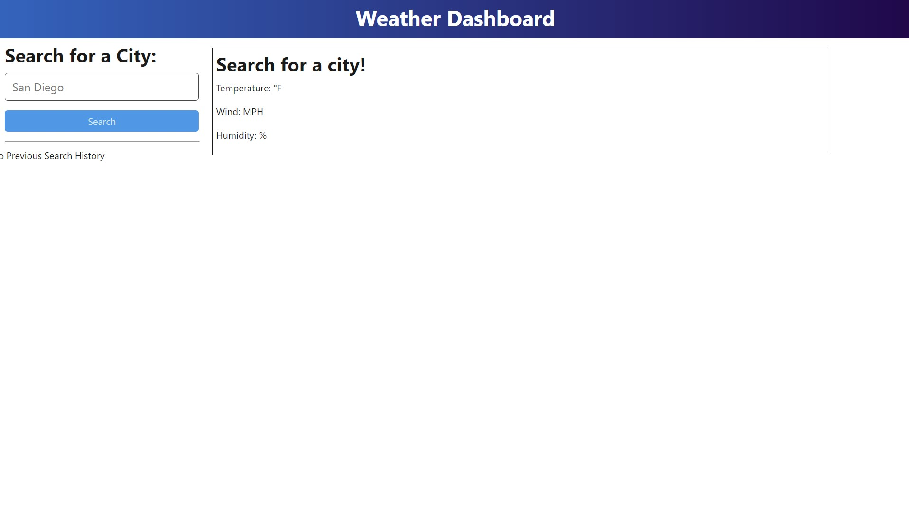
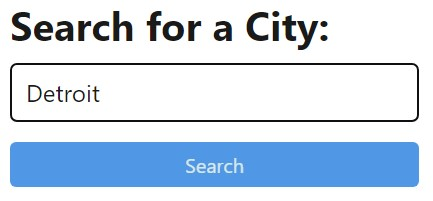
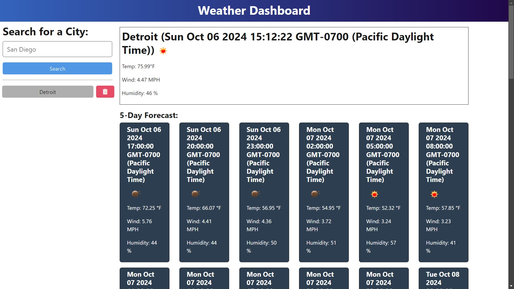
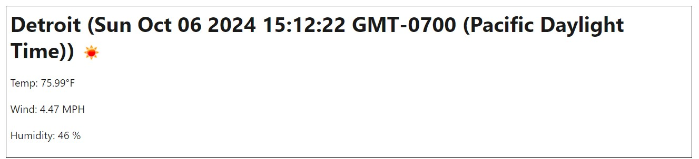
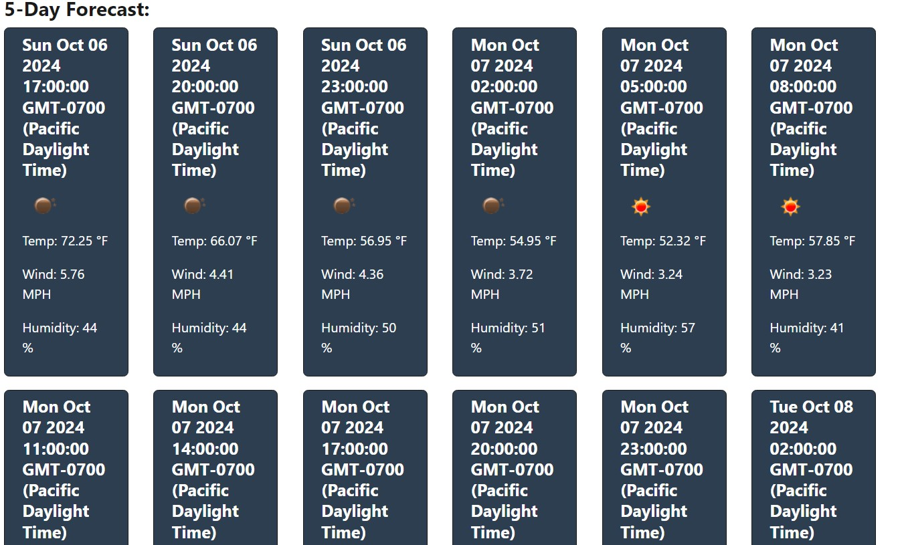

# module-09-challenge

## Description

I wanted a way to get the weather data for today and following 5 days for speicific cities using the openweathermap api. Due to how the api works, it is not possible to get the weather forecast by directly asking for the city's name. Thus additional functionality was needed to omit the intermediate steps between inputing the city name and getting the aforementioned weather data for the user. Making for a more seamless experience. The history of searched cities and the ability to delete from the history was also implemented.

## Table of Contents 

- [Installation](#installation)
- [Usage](#usage)
- [Credits](#credits)
- [License](#license)

## Installation

Please use the following link to access the deployed render link of the project.
https://module-09-challenge-stephen-lee.onrender.com 

## Usage

Upon opening the render link, the website should look as follows.

Search for a city using the input field and click the search button.

Results in the following

The following boxed area is the current weather data for the following city.

The following cards under the 5-Day Forecast are the forecasts for the next 5 days every 3 hours.

The search history gets populated as well. Can press the red trash can button to remove the history.

## Credits

Stephen Lee - https://github.com/leestephen0320
Repository Link - https://github.com/leestephen0320/module-09-challenge
Render Link - https://module-09-challenge-stephen-lee.onrender.com 
Openweatherapi documentation - https://openweathermap.org/forecast5 

## Tests

Type `Detroit` in the search bar and try to get a similar result shown in the screenshots.